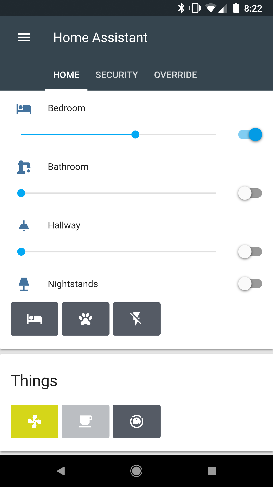
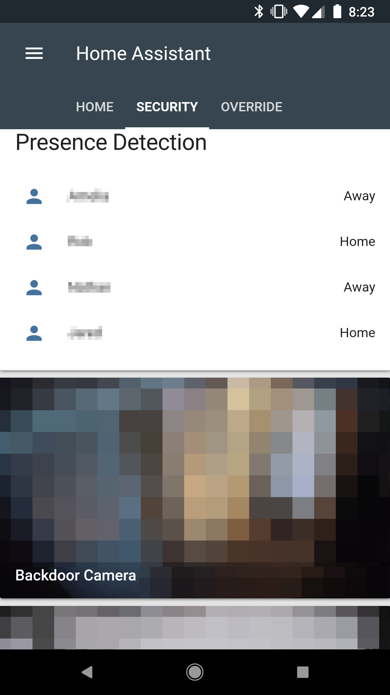
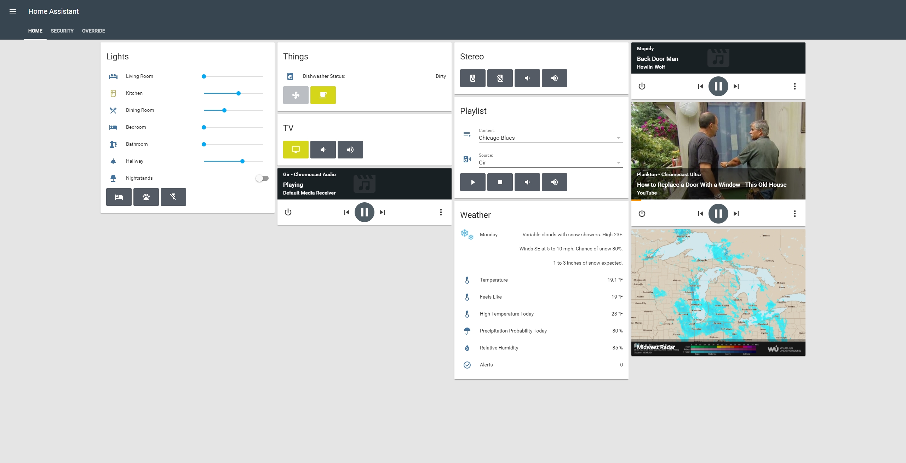
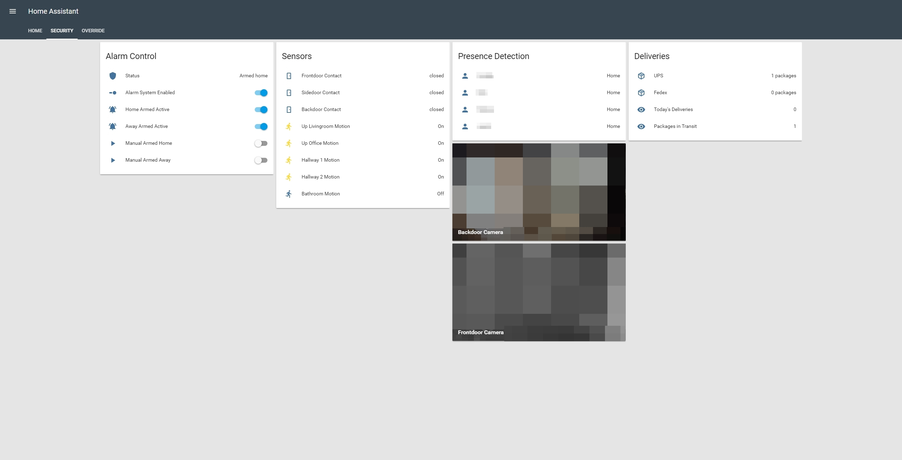
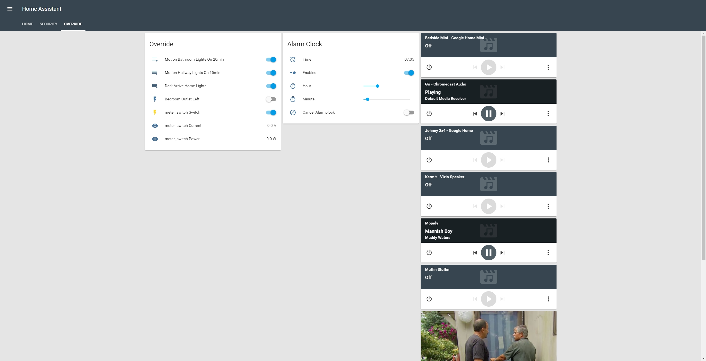

# Home Assistant
My personal implantation of [Home Assistant](https://home-assistant.io) (version: 0.60.1)

## Overview

Here is my home automation project Ive been improving since mid 2017. At that time I had switched from Samsung SmartThings and I could not be more happy with my decision. I take a firm minimalism approach to my layout, hence why the number of things are essential and concise. Also, some areas and ideas of improvement have been limited due to leasing my dwelling but that situation will be changing soon.

### In-front of Home Assistant
* HA is running in a Virtual Environment on Raspberry Pi 3 running Debian Stretch (I highly recommend running HA on a RasPi with a Z-stick). I tried Hassbian and other deployment methods but wasn't satisfied with the level of control of things I list below until I put HA on top of my own deployed OS. 
* To connect to HA externally I use my own domain through Google Domains with a Dynamic DNS record setup on a sub domain. To solve the internal/external connection problem I have a Host Override setup on my pfSense router that forwards my HA sub domain to the local IP address of HA when I'm on my local network.
* For connection security on HA I have an Nginx reverse proxy setup on the RaspberryPi that forwards requests to HA. My Nginx config is pretty strict and I have a certificate setup through [Let's Encrypt](https://letsencrypt.org/)
 that auto-renews to secure my traffic internally and externally.

### Big Components and Ideas
* Auto hide media devices when not in-use - This one was original, can be found in [mediaother.yaml](haconfig/packages/mediaother.yaml). I didn't want the clutter of 6 media devices on my main page when they are not playing anything.
* Light Alarm Clock - My bedroom lights slowly turn on and the radio cast instead of an immediate audible alarm. I believe I used [this example](https://community.home-assistant.io/t/creating-an-alarm-clock-updated/15195) from [hokagegano](https://community.home-assistant.io/u/hokagegano) on the community forum.
* Alarm Control - There is a lot of examples of HA Alarm Systems on the community forum but none did exactly what I wanted so I wrote this one myself.
* Google Assistant - I'm using the Google Assistant native integration to control lights and switches. For everything else and custom commands I setup the IFTTT integration with HA and Google Assistant, [guide here](https://community.home-assistant.io/t/how-to-integrate-google-assistant-and-home-assistant-api-using-only-ifttt/19269).
* Brightness slider below light switch - This provides the functionality of the dimming slider on the main part of a switch. [state-card-custom-ui](https://github.com/andrey-git/home-assistant-custom-ui)
* Remote custom icon layout - This is how I front end my media and other devices with buttons instead of the horizontal switch layout. I was wanting this functionality for a while as it was the last thing holding my UI back from looking right for media remotes. Big thanks to [eddi89](https://community.home-assistant.io/u/eddi89) and [mviezzer]https://community.home-assistant.io/u/mviezzer/summary)! [state-card-tiles](https://github.com/maattdiy/home-assistant-config)
* Roomba 650 IR control - My Roomba doesn't have Wifi so I use my IR blaster to automate a schedule and starting it (future consideration below). [Originated here](https://community.home-assistant.io/t/irobot-roomba/6288/9) on the community forum from [davejcameron](https://community.home-assistant.io/u/davejcameron), thanks!
* Vizio TV API - There is a native component for Vizio TVs but I had issues with it early on and switched to shell commands. Found it to be more stable and I haven't tried to switch back. [Can be found here](https://community.home-assistant.io/t/vizio-smartcast/14987) on the community forum, thanks (exiva)[https://github.com/exiva]!
* [geekofweek](https://github.com/geekofweek/homeassistant) - When I was getting started I pulled a lot of ideas and config examples from geekofweek. Many thanks to this guy!

### Future Considerations
* I would like to be able to click button start casting a Spotify playlist from HA. Spotify currently doesn't support this functionality due to a cast device discovery limitation and so I do a voice command through Google Assistant instead.
* Use a power consumption meeter Z-Wave outlet to assume states of devices. Being able to monitor the power draw of a device you can identify power usage patters that allow you to assume device state. Considering this for non smart devices: Roomba dock, dishwasher, laundry washer & drier, etc.
* When I own a residence I would like to monitor, operate and use sensors from deadbolts/doors and a garage door opener from HA.
* Getting rid of Hue things in favor of full Z-Wave consistency. Ive gone all in on Z-Wave.

## Devices
* Raspberry Pi 3
* Aeotec Z-Stick Gen5
* DIY [pfSense](https://www.pfsense.org/) router
* Asus Router (Set in AP mode) - 2

### Z-Wave Devices
* GE Z-Wave Plus In-wall Smart Dimmer Toggle 14295 - 6
* Ecolink Z-wave Plus Motion Detector PIRZWAVE2.5-ECO - 5
* Inovelli Z-Wave Plus Single Channel Smart Outlet
* Inovelli Z-Wave Plus Dual Channel Smart Outlet - 2
* Sensative Z-Wave Plus Strips Guard Contact Sensor (Don't recommend) - 3

### Controlled Devices
* Vizio 4k TV (Controlled through API)
* Nad Stereo (Controlled by Broadlink IR Blaster)
* Roomba 650 (Started by Broadlink IR Blaster)

### Media Devices
* Google Home
* Google Mini
* Chromecast Audio
* Chromecast Ultra
* Vizio Crave 360 (Chromecast built-in)
* Broadlink RM Mini Networked IR Blaster
* Hikvision Cameras - 2

### Deprecating
* Hue Bridge
* Hue White A19 - 2
* Hue Dimmer Switch

## Interface

