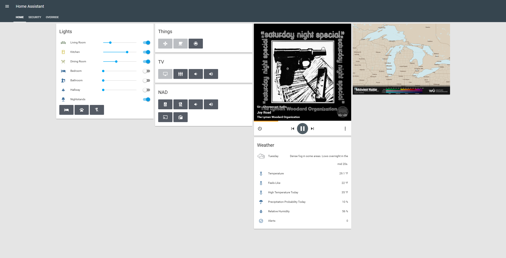
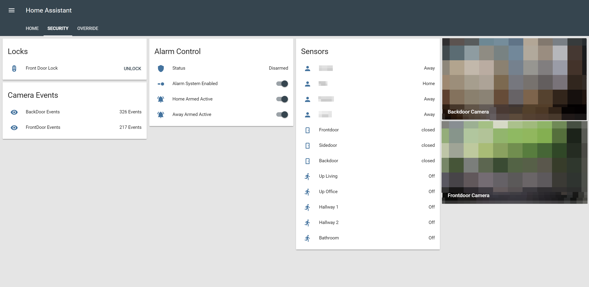
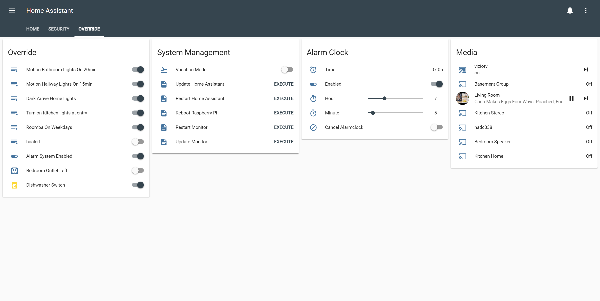

# Home Assistant

My personal implementation of [Home Assistant](https://home-assistant.io) (version: 0.79.3).
Configuration updated 10/07/2018. **Just changed my configuration over to lovelace**

## Overview

Here is my home automation project I have been improving since mid 2017. At that time I had switched from Samsung SmartThings and I could not be more happy with my decision. I take a firm minimalism approach to my layout, hence why the number of things are essential and concise.

### In-front of Home Assistant

* HA is running in a Virtual Environment on Raspberry Pi 3 running Debian Stretch (I highly recommend running HA on a RasPi with a Z-stick). I tried Hassbian and other deployment methods, but wasn't satisfied with the level of control over the things I mention below until I provisioned HA on my Debian myself.
* Connecting to HA externally, I use my own domain through Google Domains with a Dynamic DNS record setup on a sub domain. To solve the internal/external connection problem, I have a Host Override setup on my pfSense router that forwards my HA sub domain to the local IP address of HA when I'm on my local network.
* For connection security and certificate management I use Nginx to reverse proxy the connections to HA on the RaspberryPi. My Nginx config is pretty strict and I have a certificate setup through [Let's Encrypt](https://letsencrypt.org/) that auto-renews to secure my traffic internally and externally.

### High Level Components and Ideas

* Google Assistant Commands - To get around a few limitations like casting Spotify and the mediocre native TTS I am using emulated google assistant SDK on my RaspberryPi. Following a post form [chocomega](https://community.home-assistant.io/u/chocomega) [here](https://community.home-assistant.io/t/community-hass-io-add-on-google-assistant-webserver-broadcast-messages-without-interrupting-music/37274/234) he walks you though setting it up. You can find the config in [configuration.yaml](configuration.yaml), the spotify/playlist selector here [playlist.yaml](packages/playlist.yaml) and broadcast notifications here [things.yaml](packages/things.yaml).
* Presence Detection - Before I was just using a Netgear integration for Orbi. I stumbled across this cool project by [andrewjfreyer](https://community.home-assistant.io/u/andrewjfreyer) written as a simple bash script called Monitor that uses bluetooth to track presence. It doesn't require the devices to be paired, its a lot faster and more reliable when other presence detection methods when setup to run on a few nodes. I combine the presence date from both Netgear and Monitor together to get the best of both words. You can find the project here [Monitor](https://community.home-assistant.io/t/monitor-reliable-multi-user-distributed-bluetooth-occupancy-presence-detection/68505) and my implementation here [occupancy.yaml](packages/occupancy.yaml)
* Dishwasher Status/Notification - [phil1019](https://www.reddit.com/user/phil1019) shared his write up with me about monitoring dumb home devices power consumption to assume their state. I used the dishwasher portion of his setup, it can be found [here](https://philhawthorne.com/making-dumb-dishwashers-and-washing-machines-smart-alerts-when-the-dishes-and-clothes-are-cleaned/).
* Auto hide media devices when not in-use - Before I used a self made method, now lovelace has more native functionality through a [Conditional Card](https://www.home-assistant.io/lovelace/conditional/). I didn't like the clutter of 6 media devices on my main page when they are not playing anything.
* Light Alarm Clock - My bedroom lights slowly turn on, and the radio cast(s) instead of an immediate audible alarm. I used [this example](https://community.home-assistant.io/t/creating-an-alarm-clock-updated/15195) on the community forum by [hokagegano](https://community.home-assistant.io/u/hokagegano).
* Alarm Control - There are a lot of examples of HA Alarm Systems on the community forum, but none of them did exactly what I wanted, so I wrote [this one](packages/security.yaml) myself. The front end modules is the lovelace javascript module [alarm_control_panel-card](https://github.com/ciotlosm/custom-lovelace/tree/master/alarm_control_panel-card).
* [geekofweek](https://github.com/geekofweek/homeassistant) Repository - When I was getting started I pulled a lot of ideas and config examples from [geekoftheweek](https://community.home-assistant.io/u/geekoftheweek). Many thanks to this guy!
* Future Considerations - When I own my own dwelling I will probably monitor, operate, and use sensors from smart deadbolts/doors handles, smart smoke/carbon monoxide detector, smart doorbell, exterior lights, garage door opener, etc from HA.

### Custom Components

* [hass-google_keep](https://github.com/aFrankLion/hass-google_keep) - To auto-add things to my to-do list
* [nadtcp2](https://gitlab.com/mindig.marton/ha-nadtcp) - The nadtcp componect doesnt work with the Nad C 338

### Lovelace JavaScript Modules

* [Alarm Control Panel Card](https://github.com/ciotlosm/custom-lovelace/tree/master/alarm_control_panel-card)
* [Button Card](https://github.com/kuuji/button-card)
* [Mini Media Player](https://github.com/kalkih/mini-media-player)
* [Slider Entity Row](https://github.com/thomasloven/lovelace-slider-entity-row)
* [Animated Weather Card](https://community.home-assistant.io/t/custom-animated-weather-card-for-lovelace/58338)

## Devices

* Raspberry Pi 3
* Raspberry Pi Zero W - 2
* Aeotec Z-Stick Gen5
* DIY [pfSense](https://www.pfsense.org/) router
* Netgear Orbi (Set in AP mode)
* ZoneMinder

### Z-Wave Devices

* GE Z-Wave Plus In-wall Smart Dimmer Toggle 14295 - 6
* Ecolink Z-wave Plus Motion Detector PIRZWAVE2.5-ECO - 5
* Inovelli Z-Wave Plus Single Channel Smart Outlet
* Inovelli Z-Wave Plus Dual Channel Smart Outlet - 2
* NEO Z-wave Plus MINI Smart Power Plug (monitors power consumption) - 1
* Sensative Z-Wave Plus Strips Guard Contact Sensor (Don't recommend) - 3
* Kwikset 912 Z-Wave SmartCode Electronic Touchpad

### Media and Other Devices

* Hikvision Cameras - 2
* Google Home
* Chromecast Ultra
* JBL Link 20
* Vizio 4k TV
* Nad C 338
* Roomba 890
* Hue Bridge (Deprecating)
* Hue White A19 - 2
* Hue Dimmer Switch

## Interface

