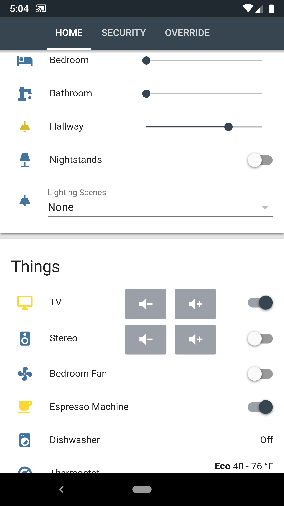
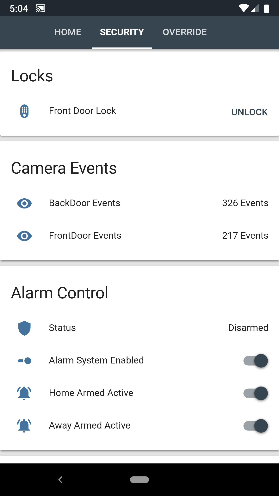
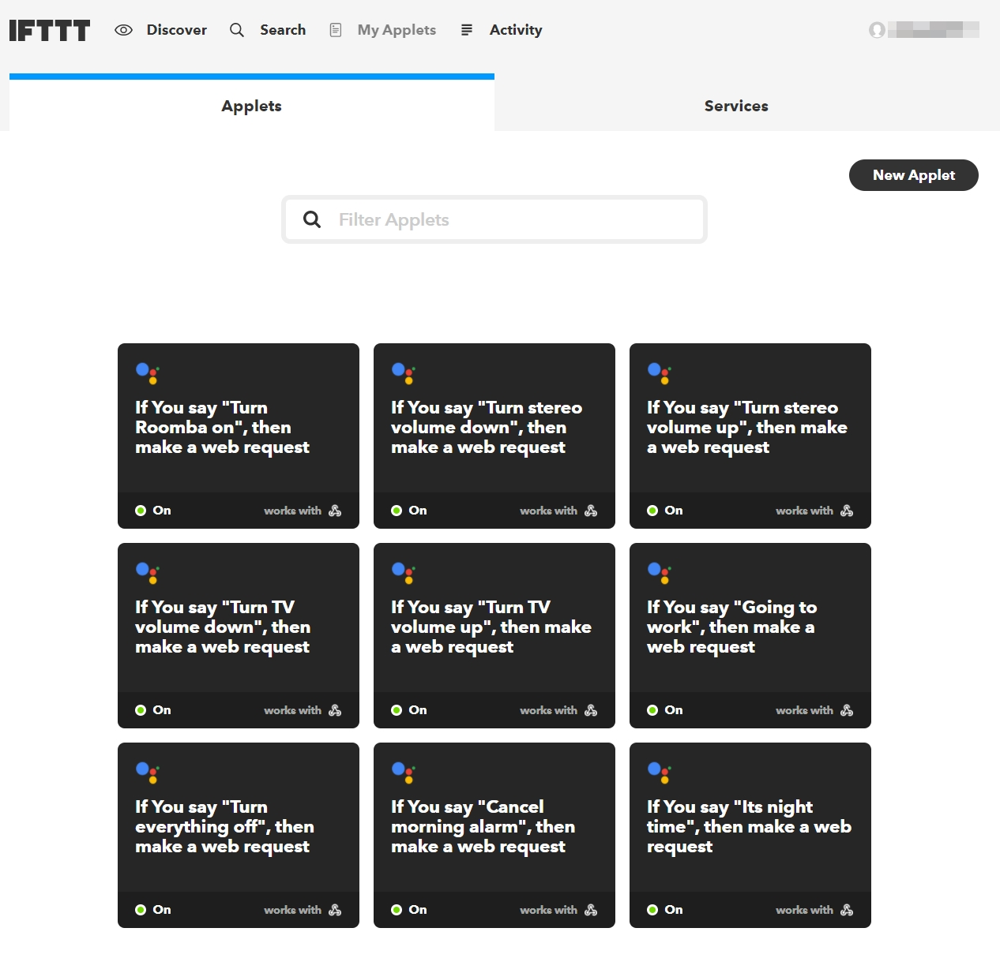

# Home Assistant
My personal implementation of [Home Assistant](https://home-assistant.io) (version: 0.63.3).
Configuration updated 2/23/2018.

## Overview

Here is my home automation project Ive been improving since mid 2017. At that time I had switched from Samsung SmartThings and I could not be more happy with my decision. I take a firm minimalism approach to my layout, hence why the number of things are essential and concise. Also, some areas and ideas of improvement have been limited due to leasing my dwelling but that situation will be changing soon.

### In-front of Home Assistant
* HA is running in a Virtual Environment on Raspberry Pi 3 running Debian Stretch (I highly recommend running HA on a RasPi with a Z-stick). I tried Hassbian and other deployment methods, but wasn't satisfied with the level of control of the things I list below until I put HA on top of my own deployed OS. 
* To connect to HA externally, I use my own domain through Google Domains with a Dynamic DNS record setup on a sub domain. To solve the internal/external connection problem, I have a Host Override setup on my pfSense router that forwards my HA sub domain to the local IP address of HA when I'm on my local network.
* For connection security on HA, I have an Nginx reverse proxy setup on the RaspberryPi that forwards requests to HA. My Nginx config is pretty strict and I have a certificate setup through [Let's Encrypt](https://letsencrypt.org/)
 that auto-renews to secure my traffic internally and externally.

### Big Components and Ideas
* Playlist - For a while there has been a limitation of automation Spotify to cast to a device. I figured out a way around that using the guide [Part 7: Get the party started with multi-room audio](https://www.vittoriomonaco.de/home-automation-part-7.html) for the backend and using [Spotify Playlist Player](https://community.home-assistant.io/t/spotify-playlist-player/22491) as the automaton/frontend. It takes a while to setup with Mopidy, Icecast2, a fallback .mp3 and not using Spotify owned playlists, but the end result is definitely worth it. Now I can play playlists on any media devices with ease and I don't have to use Spotify's app that only works sometimes. Big thanks to [vittoriom](https://github.com/vittoriom) and [GigabitGuy](https://community.home-assistant.io/u/GigabitGuy) for making this possible. You can find my adaptation here [audiocontrol.yaml](packages/audiocontrol.yaml).
* Dishwasher Status/Notification - [phil1019](https://www.reddit.com/user/phil1019) shared his write up with me about monitoring dumb home devices power consumption to assume their state. I used the dishwasher portion of his setup, it can be found [here](https://philhawthorne.com/making-dumb-dishwashers-and-washing-machines-smart-alerts-when-the-dishes-and-clothes-are-cleaned/).
* Auto hide media devices when not in-use - This one was original, can be found in [media.yaml](packages/media.yaml). I didn't want the clutter of 6 media devices on my main page when they are not playing anything.
* Light Alarm Clock - My bedroom lights slowly turn on, and the radio cast(s) instead of an immediate audible alarm. I used [this example](https://community.home-assistant.io/t/creating-an-alarm-clock-updated/15195) on the community forum. Thanks [hokagegano](https://community.home-assistant.io/u/hokagegano)!
* Alarm Control - There are a lot of examples of HA Alarm Systems on the community forum, but none of them did exactly what I wanted, so I wrote [this one](packages/security.yaml) myself.
* Google Assistant - I'm using the Google Assistant native integration to control lights and switches. For everything else and custom commands I setup the IFTTT integration with HA and Google Assistant, [guide here](https://community.home-assistant.io/t/how-to-integrate-google-assistant-and-home-assistant-api-using-only-ifttt/19269) thanks [fanuch](https://community.home-assistant.io/u/fanuch/summary)!
* Brightness slider below light switch - This provides the functionality of the dimming slider on the main part of a switch. Thanks [andrey-git](https://github.com/andrey-git)! [state-card-custom-ui](https://github.com/andrey-git/home-assistant-custom-ui) 
* Remote custom icon layout - This is how I front end my media and other devices with buttons instead of the horizontal switch layout. I wanted this functionality for a while as it was the last thing holding my UI back from looking right for media remotes. Big thanks to [eddi89](https://community.home-assistant.io/u/eddi89) and [mviezzer](https://community.home-assistant.io/u/mviezzer/summary)! [state-card-tiles](https://github.com/maattdiy/home-assistant-config)
* [geekofweek](https://github.com/geekofweek/homeassistant) Repository - When I was getting started I pulled a lot of ideas and config examples from [geekoftheweek](https://community.home-assistant.io/u/geekoftheweek). Many thanks to this guy!

Future Considerations:
* When I own a residence I would like to monitor, operate, and use sensors from smart deadbolts/doors handles, smart smoke/carbon monoxide detector, smart doorbell, exterior lights, garage door opener, etc from HA.
* Getting rid of Hue things in favor of full Z-Wave consistency. I've gone all in on Z-Wave.

## Devices
* Raspberry Pi 3
* Aeotec Z-Stick Gen5
* DIY [pfSense](https://www.pfsense.org/) router
* Netgear Orbi (Set in AP mode)

### Z-Wave Devices
* GE Z-Wave Plus In-wall Smart Dimmer Toggle 14295 - 6
* Ecolink Z-wave Plus Motion Detector PIRZWAVE2.5-ECO - 5
* Inovelli Z-Wave Plus Single Channel Smart Outlet
* Inovelli Z-Wave Plus Dual Channel Smart Outlet - 2
* NEO Z-wave Plus MINI Smart Power Plug (monitors power consumption) - 1
* Sensative Z-Wave Plus Strips Guard Contact Sensor (Don't recommend) - 3

### Controlled Devices
* Vizio 4k TV
* Nad Stereo (Controlled by Broadlink IR Blaster)
* Roomba 890

### Media Devices
* Google Home
* Google Mini
* Chromecast Audio
* Chromecast Ultra
* Vizio Crave 360 (Chromecast built-in)
* Broadlink RM Mini Networked IR Blaster
* Hikvision Cameras - 2

### Deprecating
* Hue Bridge
* Hue White A19 - 2
* Hue Dimmer Switch

## Interface

